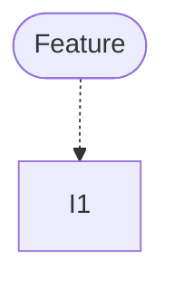

# Feature Breakdown and Dependency Map

Turn a feature request into a set of implementation-ready issue with a title, concise description and a "When this issue is done, the user can...." and a visual dependency map. The output is planning material only: do not create, edit, label, link, assign, close, or publish anything in GitHub.

## When to Use

Use this skill when the user asks to:

- Break a feature into implementation tasks or issue drafts

## Dependency map

## Local-only boundary

These are draft implementation tasks for planning and handoff. Do not create, edit, link, label, assign, close, or publish GitHub issues, and do not invent GitHub metadata.
