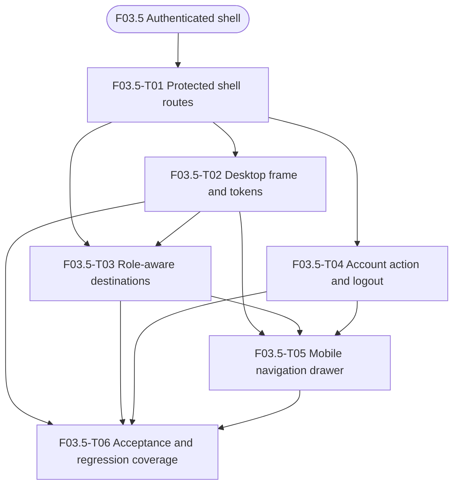
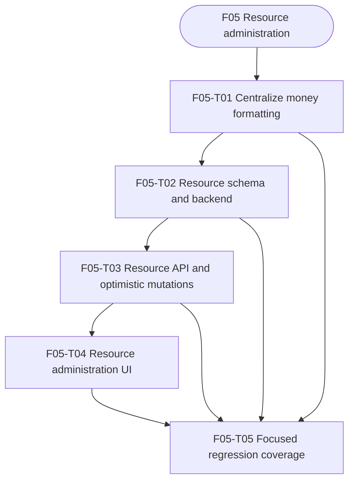

# Asset Calendar Proposed Feature Split

**Status:** Reconciled delivery contract
**Last updated:** 2026-09-15
**Source:** [Product requirements](./product-requirements.md)

The non-secret production operator boundary is defined in the
[production bootstrap contract](./production-bootstrap-contract.md).

The current `create-booking-type` branch covers the administrator booking-type
catalog for listing, creating, and editing records. It does not seed
prefilled booking types, and booking-type archival is not implemented yet.
The F05 descriptions below retain the planned follow-up work where noted.

## 1. Purpose

This document proposes an implementation sequence for the Asset Calendar MVP.
It defines features rather than individual development tasks. Each feature is a
meaningful, demonstrable increment that can later be decomposed into small
agent-ready tasks.

The sequence deliberately establishes deployment immediately after the
application foundation. This makes it possible to deploy an early application
shell to the VPS and validate the production architecture before most product
features are implemented.

## 2. Planning principles

- Features are ordered by technical and product dependency.
- A feature should not start until the contracts supplied by its dependencies
  are stable.
- Frontend restrictions are never treated as authorization. PocketBase must
  independently enforce tenant, role, ownership, and protected-field rules.
- PocketBase schema changes are delivered as version-controlled migrations.
- PocketBase hooks are used for validation involving multiple records, trusted
  server-derived values, old and new record state, or role-aware responses.
- TanStack Router is the routing authority.
- TanStack Query is the PocketBase-backed server-state authority.
- Deployment is established early and hardened progressively.
- The authenticated application shell is a shared product foundation, not an
  implementation detail of the first administration feature.
- Mobile behavior is designed, implemented, and accepted within the feature
  that introduces each workflow; later validation does not replace feature
  ownership.
- Production data is never stored inside a release directory and is never used
  by local development, CI, or agent environments.
- Production tenant, group, and initial administrator records are manually
  provisioned; F03 does not add tenant onboarding.

## 3. PocketBase terminology

- **Collection:** PocketBase's equivalent of a database table. It defines
  fields, relationships, validation, and indexes.
- **Auth collection:** A collection with PocketBase authentication and session
  capabilities.
- **Migration:** Version-controlled code that creates or changes PocketBase
  schema consistently across environments.
- **Collection rule:** An authorization expression that controls whether a
  request may list, view, create, update, or delete records.
- **Hook:** Server-side code that runs during a request or record lifecycle.
  Hooks cover rules that cannot safely be expressed as collection rules.
- **Server-authoritative validation:** Validation performed by PocketBase even
  when the React application has already validated the same input.
- **Projection:** A response containing only fields the caller is authorized to
  receive. This is important for rates and private maintenance information.
- **Historical snapshot:** A value copied onto a booking at creation so later
  changes to related records do not rewrite invoicing history.

## 4. Dependency overview

```text
F01 Application foundation and isolated runtime
 └─> F02 Initial VPS deployment and continuous delivery
      └─> F03 Tenant isolation, authentication, and password lifecycle
     └─> F03.5 Authenticated application shell and navigation
      ├─> F04 Groups administration
       │    └─> F06 Tenant user administration
       └─> F05 Resource administration
         └─> F07 Calendar navigation and resource selection

F04 + F05 + F06 + F07
 └─> F08 Regular booking creation and visibility
      ├─> F09 Booking editing and deletion
      └─> F10 Administrative, training, and maintenance bookings

F08 + F09 + F10
 └─> F12 Invoicing exports

F03.5 + F04 + F05 + F06 + F07 + F08 + F09 + F10
 └─> F11 Cross-feature mobile and accessibility validation

F01-F12
 └─> F13 Production hardening and complete system validation
```

Deployment work begins in F02. F13 does not introduce deployment for the first
time; it verifies and hardens the deployment path already used throughout
development.

## 5. Proposed features

### F01 - Application foundation and isolated runtime

**Can start:** Immediately

**Depends on:** None

**Blocks:** All other features

#### Description

Establish the shared frontend, PocketBase, and test foundations. The result is
a reproducible development environment rather than a manually configured local
application.

The frontend uses the existing pinned Vite+ 0.3.0, Node.js 24.20.0, and npm
11.19.0 toolchain. It adds Tailwind CSS, shadcn/ui, TanStack Router, TanStack
Query, and the PocketBase JavaScript SDK. F01 configures shadcn/ui but does not
generate unused components. It provides:

- File-based routing with a generated, committed typed route tree.
- A single QueryClient with conservative query retries, no automatic mutation
  retries, no initial refetch-on-window-focus behavior, and query-specific stale
  times.
- Typed query-key factories grouped by domain.
- A hand-written API layer that owns PocketBase calls and TanStack Query
  options and mutations. React components do not call the PocketBase SDK
  directly.
- A small application-error contract that classifies validation, unauthorized,
  not-found, conflict, network, and server failures while retaining the
  original cause for diagnostics.
- A minimal index route that checks PocketBase once on load and displays
  `Connected`, `Checking`, or a clear connection failure with a manual retry.

F01 does not create speculative shared loading, empty, error, unauthorized, or
not-found components. Those components are introduced by the first product
features that exercise them. It also does not integrate the Ilamy calendar,
which remains part of F07.

Frontend code is organized primarily by technical layer: `routes/`,
`components/`, `hooks/`, `api/`, `types/`, and `lib/`. Tests are colocated with
the files they cover. The `api/` layer owns server-state access; `hooks/` is for
reusable React behavior that is not server state. Route files remain thin.

The runtime pins PocketBase 0.40.3. A committed manifest records checksums for
macOS and Linux on x64 and arm64. Shared scripts download the exact archive,
verify its checksum, and cache the verified binary outside Git. All F01
PocketBase processes bind only to loopback; non-loopback bind addresses are
rejected.

Custom project tasks use Vite+'s `vp run` interface. The runtime provides a
PocketBase-only task and a combined frontend-and-PocketBase development task.
Startup ensures the binary is present and verified, applies migrations, waits
for the health endpoint, and fails clearly if the configured port is occupied.
Interactive development defaults to `127.0.0.1:8090`, with an explicit
environment override. Vite+ proxies PocketBase's native `/api/` and `/_/` paths
so browser code uses the application origin rather than an environment-specific
backend origin.

Each worktree stores persistent development data in its own ignored
`.local/pocketbase/data/` directory. Tests use fresh operating-system temporary
directories and dynamically allocated ports per worker. Verified binaries use
the user's platform cache. Scripts resolve and validate these locations rather
than accepting arbitrary data paths. An explicit worktree-scoped reset task
shows the resolved directory and requires confirmation; non-interactive use
also requires an explicit force flag. Normal startup never deletes local data.

PocketBase discovers production-bound migrations and hooks from the conventional
repository-root `pb_migrations/` and `pb_hooks/` directories. Integration-only
fixtures remain under `tests/fixtures/` and must not enter the production build
or normal development database. F01 workflows require no PocketBase superuser
credentials. A committed `.env.example` documents only safe, non-secret
configuration, and startup validates configured values.

F01 evaluates `pocketbase-typegen` against PocketBase 0.40.3, TypeScript 7, and
the selected PocketBase JavaScript SDK. The compatibility check uses a
representative migration-built isolated database and must verify supported
field, auth, relation, create, and update types as well as deterministic output.
The generator is adopted only if it works unmodified. If adopted, generated
types are committed, never edited manually, and regenerated in CI to detect
drift. If the check fails, F01 uses hand-written compile-time types and records
the deferred generator decision; F01 does not fork or patch the generator.
Runtime response validation is not introduced in this feature.

The existing Vite+ test runner covers unit and React component tests and starts
the real pinned PocketBase binary for integration tests. A rendered integration
harness under the Router and QueryClient providers uses an integration-only
collection to perform a typed query and mutation, observes the cache-backed UI
update, and verifies the stored record. The harness and fixture code are
excluded from the production module graph. Browser end-to-end tests remain
deferred.

F01 adds non-deployment CI for pull requests and `main`. CI uses locked
dependencies, verifies PocketBase 0.40.3, and runs formatting, linting, type
checking, unit/component tests, the isolated PocketBase integration test, and a
production frontend build. The executable CI matrix runs on Linux x64; the
platform resolver and checksum manifest still cover the supported macOS/Linux
x64/arm64 installer targets. Deployment remains part of F02.

#### PocketBase meaning and rationale

PocketBase stores schema and data in its runtime environment. Manually creating
collections through the administration UI would cause environments to drift.
Migrations are required so a clean checkout, CI, and production can construct
the same schema.

Pinning PocketBase is required because migration, hook, rule, and SDK behavior
may vary by version. Isolated data directories prevent tests and development
tools from reading or altering production data.

#### Completion outcome

A clean checkout can use the documented `vp` commands to start the minimal SPA
and an isolated, migration-ready PocketBase 0.40.3 instance. The index route
reports backend health through the typed API and TanStack Query boundaries. The
rendered integration harness proves a typed query and mutation against a real
ephemeral PocketBase instance without shipping fixture behavior in production.
The complete non-deployment CI pipeline passes on Linux x64, generated types
are current if the compatibility gate adopted `pocketbase-typegen`, and local,
test, agent, and future production data paths cannot overlap through the F01
scripts.

---

### F02 - Initial VPS deployment and continuous delivery

**Can start:** When F01 produces a static build and pinned PocketBase runtime

**Depends on:** F01

**Blocks:** F03 because production tenant resolution depends on the real proxy
and host model

#### Description

Establish a minimal production deployment early. The initial release may only
serve the application shell, but the same deployment path will carry every
later feature.

The feature includes:

- A production Vite build.
- A dedicated VPS service and deployment user.
- Versioned release directories.
- A persistent PocketBase data directory outside releases.
- A pinned PocketBase binary managed by `systemd`.
- PocketBase bound to a local-only interface.
- Nginx static-file serving and SPA fallback for TanStack Router.
- Nginx proxying for PocketBase.
- HTTPS and tenant-subdomain handling.
- A GitHub Actions workflow triggered after changes reach `main`.
- Build and test execution before upload.
- SSH host verification and restricted deployment credentials.
- Atomic switching of a `current` release symlink.
- PocketBase restart and basic health checks.
- Retention of at least one previous release.
- Manual production-environment approval during the initial rollout period.

#### PocketBase meaning and rationale

PocketBase data must live in a shared persistent directory such as
`/opt/asset-calendar/shared/pb_data`. Replacing a release must never replace the
database.

PocketBase must listen only on localhost. Nginx remains the public boundary for
TLS, host validation, static assets, and API proxying. PocketBase rules and
hooks still enforce authorization because Nginx cannot replace application
security.

Deploying early validates the real host and proxy assumptions used by tenant
resolution. It also reveals systemd, Nginx, certificate, path, permission, and
SPA-routing problems before the application becomes large.

#### Completion outcome

Merging approved changes to `main` builds and deploys the current application
to the VPS. Nginx serves the SPA, PocketBase responds through the proxy, its
direct port is not public, and a failed activation or health check restores the
previous release symlink and attempts to restart the previous service.
Deployment validation requires `dist`, `pb_migrations`, `pb_hooks`, and the
checksum-verified PocketBase runtime. Migrations run against persistent data
outside the release before the service starts.

#### Reconciled deployment decisions

- Production host: `nejsumlab.frontend-freelance.dk`, with
  `frontend-freelance.dk` as the root domain.
- Releases use `/opt/asset-calendar/releases`; persistent data uses
  `/opt/asset-calendar/shared/pb_data`.
- The `assetcalendar` systemd service binds PocketBase to
  `127.0.0.1:8090`; Nginx is the public HTTPS and `/api/` proxy boundary, and
  blocks `/_/`.
- Production authentication and SMTP2GO values are supplied by protected
  `/etc/asset-calendar/auth.env`, never by a release or repository file.
- The workflow builds on GitHub-hosted CI, uses protected SSH environment
  secrets, requires production approval, and checks
  `https://<configured-deploy-host>/api/health`.
- Release retention is three directories. A release rollback does not reverse
  a database migration; database recovery remains an operator backup concern.
- The dedicated sender host `mail.frontend-freelance.dk` is SMTP
  infrastructure, not an application tenant host.

---

### F03 - Tenant isolation, authentication, and password lifecycle

**Can start:** After the migration foundation and production host model exist

**Depends on:** F01 and F02

**Blocks:** F04, F05, F06, F07, F08, and F12

#### Description

Implement tenant-aware authentication and first-time password setup. Tenant
identity comes from the trusted host or subdomain and cannot be selected by
request parameters or body fields.

The production tenant, initial group, and initial administrator already exist
and are outside the application workflow. F03 includes sign-in,
sign-out, inactive-user rejection, invitation email delivery, one-time password
setup, SMTP configuration, and public and protected routes.

Invitation links are valid for 30 days and can be used once. Normal authenticated
sessions last one workday and survive page reloads. The MVP has no public
registration, public password recovery, email verification, MFA, OAuth, custom
roles, or token-revocation system. Passwords use PocketBase's built-in
validator without additional application-specific composition rules.

For the MVP's soft deactivation policy, a deactivated user cannot sign in or
start new protected actions, but an already-issued token is not revoked and an
existing browser session is not forcibly signed out before normal expiry.

#### PocketBase data and backend behavior

Migrations create:

- A tenant collection with a unique subdomain.
- A user auth collection with tenant, name, role, group, active
  status, and first-time password setup state.

Collection rules restrict every user operation to the authenticated user's
tenant and prevent regular users from changing protected fields.

Server hooks or trusted request middleware:

1. Derive the tenant from trusted host information.
2. Reject unknown tenant hosts.
3. Compare the authenticated user's tenant with the resolved tenant.
4. Ignore or reject client-supplied tenant overrides.
5. Recheck active status for protected operations.

Production invitation delivery uses SMTP2GO's authenticated SMTP relay. Local
development and CI use a mail capture or test sink. SMTP credentials remain in
protected VPS/PocketBase configuration and never enter the SPA.

#### Why backend enforcement is needed

React route guards improve navigation but are not a security boundary. A user
can call PocketBase directly with their authentication token. PocketBase must
reject cross-tenant and inactive-user requests even when the SPA is bypassed.

SMTP credentials remain server-side. Invitation responses must not disclose
whether an email address exists.

#### Completion outcome

A user authenticates only through the correct tenant host, cannot access
another tenant, and completes password setup through their invitation before
normal application access. The existing tenant administrator can create a user
and the user can receive and complete the invitation flow. Production readiness
still depends on the manual bootstrap of the existing tenant, initial group,
and active administrator; the lookup and preservation
rules are defined in the [production bootstrap
contract](./production-bootstrap-contract.md).

#### F03 contract status

The F03 MVP contract is settled. It has exactly the `administrator` and
`regular` roles, 30-day one-time invitations, one-workday sessions that
survive reloads, PocketBase built-in password validation, and soft
deactivation without global token revocation. No public registration, public
password recovery, email verification, MFA, OAuth, custom roles, or tenant
onboarding is included.

#### Manual production prerequisite

This is an operator task, not an application feature:

- Create and approve the SMTP2GO account.
- Verify a dedicated sender domain such as `mail.frontend-freelance.dk`.
- Publish SMTP2GO's SPF and DKIM DNS records.
- Publish a DMARC record for the sender domain.
- Store SMTP credentials only in protected VPS/PocketBase configuration.
- Send a smoke-test invitation to an operator-controlled address.

The VPS does not run an inbound SMTP service and does not expose an SMTP relay.
Issue [F03-T00 / #30](https://github.com/cbtgit/asset-calendar/issues/30)
tracks this prerequisite. The parent issue [F03 / #29](https://github.com/cbtgit/asset-calendar/issues/29)
records the completed F03 child work; this repository does not contain the
operator's secrets or production delivery data.

---

### F03.5 - Authenticated application shell and navigation

**Can start:** When tenant-aware authentication and protected route guards are stable

**Depends on:** F03

**Blocks:** F04, F05, F06, F07, F08, F09, F10, F11, and F12

#### Description

Establish the shared authenticated application frame that all post-login
features use. Public sign-in, password setup, and unavailable routes remain
outside this frame. Authenticated destinations render inside a shared route
outlet rather than each feature inventing its own page chrome.

The shell owns product identity, primary navigation, the current-user action,
sign-out, page landmarks, and the responsive frame. Route content owns its own
title, data layout, actions, loading states, forms, and domain-specific
navigation.

#### Visual references

F03.5 uses the supplied Groups administration screens as visual references:

- [groups-administration-desktop.jpg](./groups-administration-desktop.jpg) shows
  the wide authenticated frame: a
  branded header with Calendar and Administration module navigation, the
  current-user action, an Administration navigation rail, and a generous
  content workspace.
- [groups-administration-mobile.jpg](./groups-administration-mobile.jpg) shows
  the narrow frame: a compact branded
  header with the user action and menu trigger, a single-column content area,
  full-width primary actions, and stacked content surfaces that remain readable
  without horizontal scrolling.

These references establish composition, hierarchy, density, control sizing,
and responsive behavior. They are not a requirement for F03.5 to render the
sample group records, member counts, status data, filters, directory table, or
create action shown in the screens. Those are F04-owned Groups workflow
concerns. Where the supplied screenshots use older unit wording, the product
contract and implementation copy use `Groups`.

The visual direction is the focused operations workbench shown in the supplied
Calendar and Administration references rather than a dashboard. At viewport
widths of 768px and above, the shared shell uses a horizontal header with the
Asset Calendar identity on the left, top-level Calendar and Administration
module navigation, and the current-user action on the right. The active module
and child destination are derived from the URL. The identity and sign-in
success navigation lead to Calendar, which is the default authenticated
destination.

The shell does not own module work areas. Calendar owns its resource list and
calendar workspace. Administration owns its child-navigation pane and content
workspace. Desktop module tabs navigate to each module's default route. The
Administration module is visible only to administrators. Regular users do not
see it in either desktop or mobile navigation.

Within Administration, the desktop frame may reserve a secondary navigation
rail for implemented administration destinations. The rail is hidden on narrow
screens, where the hamburger drawer is the sole navigation surface. F03.5
establishes the rail's spacing, active-state treatment, and content offset, but
does not add future destination links solely because they appear in a visual
reference.

The shell is responsive from its first implementation. Below 768px, it uses a
compact authenticated header with a hamburger trigger. The navigation surface
takes over the full mobile viewport and slides in from the right. It has an X
close control, locks background scrolling, moves focus into the surface, and
returns focus to the hamburger trigger when it closes. It closes when the user
selects a child route, taps outside, presses the X, or uses browser Back. It
does not close on Escape. The drawer presents Calendar and Administration as
two-level accordion groups, with implemented child routes indented beneath
them. The group containing the current route is expanded and other groups are
collapsed. Only implemented child routes are shown. Log out is placed at the
bottom of the drawer.

On desktop, the current-user avatar/name trigger toggles a popover containing
only Log out. The popover closes when toggled again, when the user clicks
outside, or when navigation occurs. It does not close on Escape. Logout is
immediate, requires no confirmation, clears the local session, and navigates
to sign-in with history replacement. The shell does not define the calendar's
daily view or booking forms; those behaviors belong to F07-F10.

F03.5 establishes shared design tokens from the supplied references for the
shell and placeholder surfaces, including typography, semantic colors,
spacing, borders, radii, shadows, header and control dimensions, icon sizing,
responsive breakpoints, focus states, and active, hover, pending, and disabled
states. It does not implement F04-specific data presentation components.

F03.5 adds an administrator-only Administration > Groups route so the module
has a real first destination. That route is intentionally a placeholder: it
follows the reference screens' page-heading and introductory-copy hierarchy,
but shows a Groups heading and short placeholder text only. It does not load or
mutate group data and has no directory surface, filters, member/status data,
create button, form, edit, or delete actions. F04 replaces this placeholder
with the actual Groups list and management workflow. Resource Registry, Users &
Roles, Billing, and other administration destinations remain absent until
their routes are implemented.

Error classification remains defined by F01, authentication error handling by
F03, and domain error representation by the feature that introduces the
workflow. F03.5 does not add a speculative global error component or a shared
error-screen task. Each later feature must define its own loading, empty,
error, validation, and destructive-action states under the product
requirements.

#### Completion outcome

Every authenticated feature can render inside one consistent frame with a
predictable content landmark on desktop and narrow screens. Users can move
between implemented destinations, see only navigation allowed by their role,
and sign out without feature routes duplicating identity or navigation logic.

F03.5 does not add a dashboard, group data, resource data, calendar behavior,
booking behavior, or future administration links that do not have implemented
routes.

#### F03.5 implementation issue drafts

The following local draft identifiers are planning references only. They are not
GitHub issue numbers or metadata. Each draft stays within the F03.5 contract;
feature data workflows, calendar behavior, and future administration links
remain owned by later features.



##### F03.5-T01 - Establish the protected shell route foundation

**Depends on:** F03

**Description:** Add the authenticated route layout and shared outlet that
contains post-login destinations. Connect the existing F03 route guard and
session state without duplicating authentication logic. Add only the route
scaffolding needed for the Calendar default destination and the
administrator-only Groups placeholder; keep route content responsible for its
own data and states. Define the page landmarks and route-derived active
destination data that later shell pieces consume.

**When this issue is done, the user can:** sign in and reach a stable
authenticated frame, refresh or directly open an implemented protected route,
and see route content rendered through one shared outlet.

##### F03.5-T02 - Build the shared tokens and desktop application frame

**Depends on:** F03.5-T01

**Description:** Define the F03.5 design tokens and implement the desktop
layout at widths of 768px and above. Add Asset Calendar identity, Calendar and
Administration module navigation, the authenticated content landmark, and the
optional Administration rail using only implemented destinations. Match the
supplied references for spacing, typography, control dimensions, semantic
states, borders, radii, shadows, and focus treatment without introducing
feature data surfaces.

**When this issue is done, the user can:** orient themselves in the Asset
Calendar application, identify the active module and destination from the URL,
and use a consistent desktop frame for authenticated pages.

##### F03.5-T03 - Add role-aware destinations and the Groups placeholder

**Depends on:** F03.5-T01 and F03.5-T02

**Description:** Register the implemented Calendar and Administration
destinations and enforce their navigation visibility from the authenticated
user role. Expose Administration and its Groups child route only to
administrators. Render the Groups placeholder with the contracted heading and
introductory copy, while omitting group records, filters, directory data,
mutations, and links for Resources, Users & Roles, Billing, or other future
destinations. Ensure direct navigation cannot use the shell to bypass the
administrator-only boundary.

**When this issue is done, the user can:** navigate between the implemented
destinations permitted for their role, while regular users neither see nor
reach the administration surface.

##### F03.5-T04 - Implement the authenticated account action and logout

**Depends on:** F03.5-T01 and F03.5-T02

**Description:** Add the desktop current-user avatar/name trigger and its
single-action popover. Close it when toggled, clicked outside, or navigation
occurs, but not on Escape. Wire Log out to the existing F03 session cleanup and
navigate to sign-in with history replacement, without confirmation or a second
authorization path.

**When this issue is done, the user can:** open their account action, sign out
immediately, and arrive at sign-in without the protected page remaining in
browser history.

##### F03.5-T05 - Implement the responsive mobile navigation drawer

**Depends on:** F03.5-T02, F03.5-T03, and F03.5-T04

**Description:** At widths below 768px, replace the desktop navigation with a
compact header, hamburger trigger, and full-viewport right-side drawer. Add
the contracted two-level Calendar and Administration accordions using only
implemented child routes, role-aware visibility, bottom-anchored Log out,
outside-tap handling, route-selection close, X close, browser-Back close,
background scroll locking, and focus move/restore behavior. Preserve the
contracted no-Escape-close behavior and keep the drawer usable without
horizontal scrolling.

**When this issue is done, the user can:** navigate every implemented
authenticated destination on a narrow screen, close the drawer through each
supported interaction, and continue from the control that opened it after
closing.

##### F03.5-T06 - Verify the shell contract with focused regression coverage

**Depends on:** F03.5-T02, F03.5-T03, F03.5-T04, and F03.5-T05

**Description:** Add focused route and component coverage for the shared
authenticated outlet, default Calendar navigation, role-based module and
Groups visibility, active URL-derived navigation, logout cleanup and history
replacement, desktop account-popover dismissal, and mobile drawer behavior.
Cover the 768px boundary, focus movement and restoration, scroll locking,
browser-Back close, outside-tap close, route-selection close, and the explicit
no-Escape-close rule. Confirm the placeholder does not load or mutate group
data and that no future administration links are rendered. Keep the checks
within the existing unit/component test setup; browser end-to-end testing
remains deferred as specified by F01.

**When this issue is done, the user can:** use the authenticated shell on
desktop and narrow screens with the documented role, navigation, logout,
focus, and placeholder behavior protected against regression.

---

### F04 - Groups administration

**Status:** Merged and implemented

**Can start:** When tenant-scoped administrator authorization and the shared
application shell are stable

**Depends on:** F03 and F03.5

**Blocks:** F06 and group snapshots in F08

#### Description

Allow administrators to list, create, rename, and delete groups within their
tenant. Every user belongs to exactly one group.

The frontend provides typed administration routes, accessible forms, and
TanStack Query operations with consistent invalidation inside the shared
administration destination. F04 replaces the F03.5 Groups placeholder with the
actual Groups list and management workflow. It does not add placeholder links
for future Resource Registry, Users & Roles, or Billing routes.

On narrow screens, the group list remains readable as a single-column or stacked
layout without horizontal scrolling. Create and edit use a full-width or
full-screen surface with labels, validation, focus handling, and destructive
confirmation that remain usable by keyboard and touch.

#### PocketBase data and backend behavior

Groups are stored in PocketBase's existing `organizational_units` collection
for schema compatibility. The product and API contract refers to these records
as Groups. The collection has a required tenant relationship, name, and
timestamps. F04 adds the hidden `name_normalized` field and a tenant-scoped
unique index over `(tenant, name_normalized)`.

Group names are trimmed, must contain at least one non-whitespace character,
and may be at most 200 characters long. Uniqueness is case-insensitive and is
enforced against the trimmed lowercase value. Clients cannot supply or change
`name_normalized` or the tenant relationship.

The underlying collection has tenant-scoped list and view rules restricted to
same-tenant administrators. Writes are also limited to same-tenant
administrators. The administrator UI reads the `/api/groups` projection, which
returns sorted groups with `member_count` and is restricted to same-tenant
administrators.
Before deletion, a server hook queries users assigned to the group and rejects
deletion when any remain.

#### Why the backend check is needed

A disabled delete button can be bypassed with a direct API request. The state
may also change between a frontend availability check and deletion. PocketBase
must make the final decision immediately before deleting the group.

Bookings later store the group name as a snapshot. Renaming or deleting an
unused group therefore does not rewrite historical exports.

#### Completion outcome

Administrators can manage same-tenant groups, while assigned and cross-tenant
groups remain protected. The feature works inside the shared shell on desktop
and narrow screens, including list, create, rename, and delete flows.

#### Settled decisions

- Names are trimmed and normalized to lowercase for uniqueness; the displayed
  name preserves its original casing after trimming.
- Names must contain non-whitespace content and may be at most 200 characters.
- The initial manually created group has no special deletion exception. It may
  be deleted when no users are assigned.
- The administrator projection is available at `/api/groups` and
  `/api/groups/:id`. Regular users are rejected by both the projection and the
  underlying collection rules.

---

### F05 - Resource administration and centralized money formatting

**Can start:** When tenant-scoped authorization and the shared application
shell are stable

**Depends on:** F03 and F03.5

**Blocks:** F07 and F08

#### Description

Deliver administrator resource management as a focused slice of F05 while
keeping the already-merged booking-type catalog stable. The existing tenant's
money context is DKK with `da-DK` formatting. Centralize that formatting so
resource rates and existing booking-type surcharges do not depend on the
browser's locale or on separate component-level defaults.

This increment includes resource listing, creation, and editing; localized
base-rate input and display; tenant-scoped authorization; and the nullable,
server-managed `archived_at` field required by the resource schema. It does
not add tenant settings, editable locale or currency, archive actions, archive
filtering, booking behavior, or changes to booking-type authorization.

Resource lists, forms, and rate fields must remain usable at the existing
responsive boundary without horizontal scrolling. The same tenant and role
rules apply at every viewport size.

A versioned migration creates a tenant-owned resources collection with:

- A required tenant relation.
- A trimmed, non-blank display name.
- A hidden normalized name and tenant-scoped unique index.
- A safe non-negative integer `base_rate_minor_units` field.
- A nullable, server-managed `archived_at` field.
- PocketBase timestamps.

Authenticated users in the resolved tenant may read resource names, rates, and
`archived_at`. Only same-tenant administrators may create or update resources.
The tenant is derived from trusted request context, and clients cannot set or
change the tenant, normalized name, or `archived_at` value.

Hooks validate trimmed names, safe integer rates, and case-insensitive
tenant-scoped uniqueness. They reject invalid or client-controlled protected
fields. This increment does not implement archive transitions, immutable
archived configuration, active-resource filtering, booking conflicts, or
booking authorization.

#### Why backend validation is needed

React forms and TypeScript mutation types do not protect PocketBase from direct
requests. Collection rules and hooks must enforce tenant isolation,
administrator-only writes, normalized-name uniqueness, valid minor-unit rates,
and preservation of the server-managed archival field independently of the
frontend.

Resource prices and metadata are not secret in this increment, so no resource
response projection or rate redaction is needed. Projection remains available
for later workflows that contain genuinely private data.

#### Completion outcome

Administrators can create, rename, and reprice resources in their tenant, while
same-tenant authenticated users can read the resource data needed by later
calendar work. Existing booking-type administration continues to work, and
all money values use one application-level `da-DK` policy until tenant settings
are introduced in a later feature.

#### Settled decisions

- Tenant settings are explicitly excluded: no tenant currency or locale
  migration, settings endpoint, settings route, or editable locale/currency UI.
- Until tenant settings exist, `da-DK` is the application-level number locale
  and the existing tenant's currency context is DKK.
- Money is stored as safe non-negative integer minor units. Editable fields use
  localized numeric text; read-only values use the centralized formatter.
- Resource names are trimmed, non-blank, at most 200 characters, and unique
  per tenant after lowercasing for comparison.
- Resources include nullable, server-managed `archived_at`, but this slice has
  no archive action, transition, filtering, or immutable archived workflow.
- Resource prices and metadata are not secret. Same-tenant authenticated users
  may read them; administrator authorization still protects writes.
- Booking types are already delivered and remain administrator-read and
  administrator-write. Only their money-formatting call sites and tests are
  updated to use the centralized policy.
- Booking creation, calendar behavior, booking snapshots, invoicing,
  projections, rate redaction, tenant settings, and booking-type archival or
  system-type follow-up work remain outside this increment.

#### F05 implementation issue drafts

The following local draft identifiers are planning references only. They are
not GitHub issue numbers or metadata. Each draft stays within this narrowed
resource contract; booking creation, booking snapshots, calendar behavior,
tenant settings, and booking-type follow-up work remain owned by later work.



##### F05-T01 - Centralize the application money policy

**Depends on:** F03.5

**Description:** Add one parameterized money-formatting utility under
`src/lib/` with `da-DK` as the application default and DKK as the current
currency context. Keep localized input text compatible with the existing
number parser and provide a separate read-only currency display operation.
Update the booking-type form and directory to use the utility without
changing booking-type behavior or access rules.

**When this issue is done, the user can:** see consistent Danish formatting in
resource and booking-type money fields regardless of the browser locale.

##### F05-T02 - Add and enforce the resource collection

**Depends on:** F05-T01

**Description:** Add the versioned resource migration and server-side rules.
Allow same-tenant authenticated reads and same-tenant administrator writes.
Normalize and validate names, validate safe non-negative integer base rates,
enforce tenant-scoped case-insensitive uniqueness, and explicitly reject
client-controlled tenant, normalized-name, and `archived_at` values. Include
the archival field in the schema without adding archive behavior.

**When this issue is done, the user can:** access only their tenant's resource
records, while invalid writes and protected-field changes are rejected by
PocketBase.

##### F05-T03 - Add typed resource access and optimistic mutations

**Depends on:** F05-T02

**Description:** Add resource types, query keys, PocketBase API functions, and
TanStack Query hooks by adapting the booking-type implementation. Include
`archived_at` in response types but omit it from client-writable payloads.
Create and update mutations must cancel affected queries, snapshot cached data,
apply an optimistic update, roll back and surface failures, then invalidate or
reconcile after settlement. Do not add archive mutations, projections, or
active-resource selection queries.

**When this issue is done, the user can:** see resource changes immediately,
with failed mutations restoring the previous cache and successful mutations
reconciling with PocketBase.

##### F05-T04 - Build the administrator resource workflow

**Depends on:** F03.5 and F05-T03

**Description:** Add resource list, create, and edit routes and components by
adapting the existing booking-type structure. Use the centralized formatter
for `da-DK` base-rate input initialization and read-only display. Preserve
server-provided `archived_at` as display-only when populated, without archive
controls or filtering. Keep the list and forms usable below 768px without
horizontal scrolling and with established labels, focus behavior, and touch
targets.

**When this issue is done, the user can:** create, rename, and reprice tenant
resources from the administrator area on desktop and narrow screens.

##### F05-T05 - Verify the narrowed resource slice

**Depends on:** F05-T01, F05-T02, F05-T03, and F05-T04

**Description:** Add focused utility, migration, hook, API, route, and
component coverage for centralized `da-DK` formatting, localized numeric
input, tenant isolation, administrator-only writes, normalized-name conflicts,
invalid and unsafe rates, protected-field rejection including `archived_at`,
optimistic success and rollback, responsive resource workflows, and the
absence of archive and tenant-settings controls. Preserve booking-type
formatting regressions. Do not add projection or rate-redaction tests.

**When this issue is done, the user can:** rely on the resource administration
slice to preserve tenant boundaries, money-formatting consistency, protected
fields, optimistic mutation behavior, and usable desktop and narrow-screen
interactions.

---

### F06 - Tenant user administration and active-user selection

**Can start:** When authentication, groups, and the shared
application shell are stable

**Depends on:** F03, F03.5, and F04

**Blocks:** F08 and F10

#### Description

Allow administrators to create and manage tenant users while retaining booking
history and providing active-user selection data for future booking workflows.

The feature includes user listing, creation, group assignment, role changes,
reversible deactivation, invitation email delivery, password setup, and
active-user selection data.

#### PocketBase data and backend behavior

The auth collection requires a tenant, group, normalized globally unique email,
role, active status, and password-setup state.

A creation hook derives the tenant server-side, verifies the selected group is
in that tenant, normalizes the email, and sends the invitation email with a
one-time password-setup link. Email is immutable after creation.

Administrators may demote or deactivate themselves through the normal mutation
path. A tenant may temporarily have zero active administrators; PocketBase
operator access is the documented recovery path.

Deactivation preserves the user and bookings but excludes that user from new
booking selectors and booking creation.

The user list and user editor are responsive from their first implementation.
On narrow screens, user records remain scannable without horizontal scrolling,
and create/edit, role, group, invitation, and deactivation actions use a
full-width or full-screen surface with the same focus, validation, and
confirmation behavior as desktop.

#### Why hooks are needed

Tenant assignment must come from trusted server context rather than a submitted
tenant ID. Server-owned projections also prevent raw PocketBase auth metadata
from becoming part of the browser contract.

#### Completion outcome

Administrators can manage same-tenant users without privilege escalation,
cross-tenant assignment, or historical deletion. Inactive users remain editable
but cannot sign in, start new protected actions, or appear in active-user
selection data. The complete user-management workflow is usable inside the
shared shell on desktop and narrow screens.

---

### F07 - Calendar navigation and safe resource selection

**Can start:** When authentication, safe resource queries, and the shared
application shell are stable

**Depends on:** F03, F03.5, and F05

**Blocks:** F08 and F11

#### Description

Provide the main calendar surface with desktop day, week, and month views,
resource selection, period navigation, 15-minute slots, Monday-first weeks,
24-hour time, and typed URL-backed date, view, and resource state.

The Ilamy calendar is a view and interaction surface, not a source of truth.
Drag-and-drop remains disabled.

Responsive behavior is part of F07. Desktop provides the required resource list
and larger calendar pane. Narrow screens use the daily view, a compact resource
selector above the calendar, and no slide-in resource drawer. The calendar and
selector must remain usable without horizontal scrolling, and URL-backed state
must continue to work at both viewport sizes.

#### PocketBase and backend behavior

The frontend needs role-safe endpoints for active resources and visible
bookings. Queries are scoped by resolved tenant, selected resource, and visible
time interval.

Responses must omit rates, foreign-tenant data, and private maintenance fields
before they reach the browser. This may require a custom PocketBase route or
safe projection rather than unrestricted raw collection access.

#### Why server-side response shaping is needed

Data hidden by a React component remains visible in browser developer tools.
PocketBase must never send unauthorized rate or maintenance identity fields to
regular users.

Time-range filtering reduces unnecessary transfer and prevents loading all
tenant bookings when only one resource and period are visible.

#### Completion outcome

Users can select a resource, navigate calendar periods, refresh or share the
current URL state, and view only permitted booking information.

#### Missing decisions

- Default desktop view and initial date.
- Desktop/mobile breakpoint.
- Exact event content and visual treatment.
- Training-booking visibility for regular users.
- Archived-resource selection behavior.
- Whether visible-range queries return bookings intersecting the interval.
  Intersection semantics are recommended for correct rendering.

---

### F08 - Regular booking creation, snapshots, and visibility

**Can start:** When units, resources, users, and the calendar are stable

**Depends on:** F03.5, F04, F05, F06, and F07

**Blocks:** F09, F10, F11, and F12

#### Description

Allow regular users to create future regular bookings and allow tenant users to
view the permitted booking details.

The frontend provides a reusable booking form opened from day/week slots or a
month date. The selected resource is implicit, regular type is automatic, and
prices are absent.

The booking form is responsive from its first implementation. On desktop it
uses the right-hand content pane while the resource pane remains available. On
narrow screens it becomes a full-width or full-screen experience with the same
field order, labels, validation, focus behavior, and authorization rules.

#### PocketBase data and backend behavior

A booking migration creates tenant, resource, booked-for user, created-by user,
type, UTC start and end, resource base-rate snapshot, booking-type surcharge
snapshot, effective-rate snapshot, booker snapshots, resource/type-name
snapshots, and timestamps.

A creation hook:

1. Resolves the authenticated user and tenant.
2. Derives tenant, ownership, type, and creator values server-side.
3. Rejects cross-tenant or archived relationships.
4. Validates future start, positive duration, and 15-minute boundaries.
5. Checks overlap on the same resource using end-exclusive intervals.
6. Loads the applicable trusted resource base rate and booking-type surcharge.
7. Copies booker, group, email, resource, type, and pricing snapshots.
8. Rejects client attempts to supply protected values.

Overlap is detected when:

```text
existing.start < proposed.end
AND existing.end > proposed.start
```

#### Why hooks and snapshots are needed

A user can bypass form validation and submit another tenant's resource, a
privileged type, or a manipulated rate. The server must derive protected values
from authenticated identity and trusted records.

Snapshots prevent later name, group, email, resource, booking-type, or pricing
changes from rewriting historical invoicing data. Tenant currency is immutable,
so a booking does not need a separate currency snapshot.

The MVP accepts a narrow race between simultaneous overlap checks because
database-level serialization is explicitly out of scope.

#### Completion outcome

A regular user can create a valid future booking. PocketBase independently
enforces time, tenant, ownership, resource, conflict, and snapshot rules.

#### Missing decisions

- Grace and precision for the future-start check.
- Default month-view start and end times.
- Maximum practical booking duration.
- Exact booking information shown on events versus details.
- Whether the non-atomic overlap race is explicitly accepted.

---

### F09 - Booking editing and permanent deletion

**Can start:** When regular booking creation and details work

**Depends on:** F08

**Blocks:** F11, F12, and F13

#### Description

Allow eligible regular users and administrators to edit or permanently delete
bookings while preserving immutable history and role-specific time rules.

The frontend provides booking details, a reusable edit form, role-aware
actions, explicit delete confirmation, and TanStack Query invalidation.

Editing and deletion are responsive from their first implementation. Desktop
uses the shared booking content area; narrow screens use a full-width or
full-screen detail/edit surface. Confirmation, validation, focus placement, and
error recovery must remain usable without horizontal scrolling.

#### PocketBase and backend behavior

Update hooks load the stored booking and compare old and proposed state.

For regular users, PocketBase verifies ownership and requires both current and
proposed starts to be at least 24 hours in the future.

For administrators, PocketBase permits time editing without that restriction.
All edits revalidate interval boundaries and overlap.

Tenant, resource, type, creator, and historical snapshots remain protected.
Deletion hooks enforce ownership and the 24-hour rule for regular users, and
future-current-start eligibility for administrators.

#### Why old and new state are both required

The regular-user rule depends on the existing start as well as the proposed
start. A submitted payload alone cannot prove eligibility. Snapshot and
immutable-field protection also requires comparison with the stored record.

Delete confirmation prevents accidents but is not authorization. Direct API
deletion must still be rejected by PocketBase when ineligible.

#### Completion outcome

Users can edit or delete only when permitted, and crafted requests cannot alter
ownership, tenant, resource, type, snapshots, or protected history.

#### Missing decisions

- Whether `booked_for_user` is immutable after creation.
- Whether an administrator may move a completed booking into the future.
- Whether an administrator may move a future booking into the past.
- Whether inactive users retain mutation rights through existing sessions.
- Behavior when eligibility changes while an edit form is open.

---

### F10 - Administrative, training, and maintenance bookings

**Can start:** When user selection and regular booking creation work

**Depends on:** F06 and F08

**Blocks:** F11, F12, and F13

#### Description

Extend booking creation for administrators. Administrators can create regular
or training bookings for an active user and maintenance blocks for a resource.

Training uses the resource base rate plus the training-type surcharge.
Maintenance has no rate, is not billable, participates in conflicts, and
appears to regular users only as a generic unavailable interval. Custom types
use the resource base rate plus their tenant-wide surcharge.

Administrative, training, and maintenance creation uses the same responsive
booking surfaces established by F08 and F09. On narrow screens, administrators
can select the booking type and active user where applicable, complete the
form, view permitted details, and confirm destructive actions without
horizontal scrolling or a separate authorization path.

#### PocketBase and backend behavior

The booking hook verifies administrator role and same-tenant relationships.
For regular, training, and custom billable bookings, it sets the selected
active user as owner, the administrator as creator, and selects the correct
trusted resource base rate and booking-type surcharge.

For maintenance, it records the creating administrator as required by the PRD,
stores no rate, and includes the interval in overlap checks.

Regular-user responses must be sanitized so they do not contain maintenance
type or administrator identity. Administrators receive the permitted full
detail.

#### Why rate selection and privacy belong on the backend

The client selects a booking type, not a numeric rate. PocketBase loads the
resource and type configuration and derives the effective rate, preventing
manipulated or stale snapshots.

Changing an administrator name to "Unavailable" in React does not protect the
identity if the raw response contains it. Role-aware projection must happen
before the data reaches the browser.

#### Completion outcome

Administrators can create all booking types. Training and custom billable types
use the resource base rate plus the selected type surcharge, maintenance blocks
the resource and remains non-billable, and regular users cannot discover
private maintenance information.

#### Missing decisions

- What regular users see for training bookings.
- Whether an assigned regular user may edit or delete a training booking. The
  current PRD implies that they may.
- Whether maintenance needs a title, reason, or description.
- Exact administrator maintenance details.
- Whether maintenance identity fields are immutable during editing.

---

### F11 - Cross-feature mobile and accessibility validation

**Can start:** Incrementally as UI features land; completes after F04-F10 and F12

**Depends on:** F03.5, F04, F05, F06, F07, F08, F09, and F10

**Blocks:** F13

#### Description

Validate and harden the complete responsive application experience against the
contracts established by the individual UI features. F11 is not the first
feature where mobile behavior is implemented. It finds cross-feature gaps,
inconsistent interaction patterns, and accessibility regressions after the
shell, administration, calendar, booking, and export surfaces exist.

The validation covers desktop and narrow-screen navigation, Groups and resource
administration, user administration, calendar selection, booking
creation/edit/delete, booking-type workflows, and export controls. It checks
that each workflow avoids horizontal scrolling, preserves role and tenant
behavior, provides usable keyboard and touch interaction, places and restores
focus predictably, exposes labels and validation errors programmatically, and
meets the agreed contrast and target-size requirements.

F11 may repair shared interaction or accessibility gaps where the responsible
feature cannot do so without cross-feature coordination. It must not move
feature-specific behavior into a generic mobile layer or create a second
authorization path.

#### PocketBase and backend implications

Mobile uses the same PocketBase rules, hooks, and safe response projections as
desktop. Responsive UI must not create a second authorization path or weaker
validation behavior.

#### Completion outcome

All implemented workflows are usable on supported desktop and narrow-screen
viewports and through keyboard and assistive interaction without changing
backend security behavior. The result is a verified, coherent experience
rather than a late mobile port.

#### Missing decisions

- Responsive breakpoint and minimum supported viewport.
- Minimum touch-target size.
- Whether WCAG 2.2 AA is mandatory rather than aspirational.
- Supported assistive-technology test combinations.
- Whether mobile full-screen surfaces create browser-history entries.

---

### F12 - Server-generated invoicing exports

**Can start:** When snapshots, final-duration editing, and maintenance behavior
are stable

**Depends on:** F08, F09, and F10

**Blocks:** F13

#### Description

Allow administrators to export tenant billing data as CSV and Excel from one
shared, server-generated billing projection.

The frontend provides an administrator-only route, application-timezone start
and end fields, format selection, and an export mutation. The browser performs
no billing calculation. The export controls are responsive from their first
implementation: on narrow screens, date/time fields and format selection stack
without horizontal scrolling, validation remains announced, and the download
action remains reachable by keyboard and touch.

#### PocketBase and backend behavior

An authenticated custom endpoint:

1. Resolves and authorizes the active tenant administrator.
2. Parses the selected interval in the application timezone.
3. Converts inclusive start and exclusive end to UTC.
4. Selects same-tenant bookings by the PRD's start-time filter.
5. Excludes maintenance.
6. Uses stored historical snapshots.
7. Calculates actual elapsed duration from UTC instants.
8. Multiplies duration by the exact stored effective-rate snapshot.
9. Applies decimal half-up rounding to the tenant currency's supported
   fractional digits.
10. Produces format-neutral rows.
11. Serializes the same rows as CSV or `.xlsx`.

#### Why export generation belongs on the backend

Client-side generation would require sending billing data to the browser and
would allow a modified client to change filtering or calculations. Server
generation keeps authorization, tenant scoping, timezone conversion, decimal
arithmetic, and format parity under one trusted implementation.

UTC duration is required around daylight-saving transitions because displayed
local-clock duration may not equal actual elapsed time.

#### Completion outcome

Administrators can download logically identical CSV and Excel exports with
correct tenant filtering, snapshots, duration, and amounts in the tenant's
single immutable currency. No foreign-exchange conversion is performed.

#### Missing decisions

- CSV delimiter, quoting, encoding, and BOM behavior.
- Exact headers and column order.
- Timestamp and duration formats.
- Tenant column value.
- Excel cell types and formats.
- Empty-export behavior.
- Maximum interval and row count.
- Filename convention.
- Exact decimal storage and arithmetic implementation.

---

### F13 - Production hardening and complete system validation

**Can start:** Incrementally throughout development; completes after F01-F12

**Depends on:** F01-F12

**Blocks:** Unattended production release

#### Description

Harden the deployment established in F02 and prove that frontend behavior,
PocketBase enforcement, migrations, backup, rollback, and production
configuration operate together.

The feature includes:

- Direct PocketBase tests for tenant, role, ownership, relationship, and
  protected-field attacks.
- Booking boundary, overlap, snapshot, archive, deactivation, reactivation,
  and zero-active-administrator tests.
- Maintenance privacy tests against raw responses.
- Export authorization, timezone, DST, decimal, and parity tests.
- TanStack Router guard and URL-state tests.
- TanStack Query loading, mutation, failure, and invalidation tests.
- An end-to-end sign-in, resource-selection, booking-creation, and visibility
  smoke test.
- Deployment locking and concurrent-deployment protection.
- Pre-migration production backup.
- Migration failure handling.
- Release and data permission review.
- Health and smoke checks after deployment.
- Tested application rollback.
- Documented database recovery procedure.
- Log location and retention.
- Removal of temporary rollout allowances.
- A decision on retaining or removing manual GitHub environment approval.

#### PocketBase and backend rationale

UI tests exercise expected behavior but do not prove authorization. Backend
tests must deliberately submit malicious payloads, including foreign tenant
IDs, privileged booking types, altered snapshots, changed ownership, and
requests for private maintenance data.

Static-file rollback is achieved by switching the release symlink. Database
rollback is more difficult because a migration may change persistent schema or
data. Backward-compatible migrations, pre-deployment backups, and rehearsed
recovery are therefore required before unattended deployment.

#### Completion outcome

The complete MVP passes automated and direct-API security tests, deployment
failures are surfaced, production data is protected, and the application can
be deployed and recovered using documented procedures.

#### Missing decisions

- Backup destination and retention.
- Migration compatibility and rollback policy.
- Log retention and monitoring expectations.
- Health-check and alerting mechanism.
- Recovery-time and recovery-point expectations.
- Whether production deployment remains manually approved.

## 6. Recommended delivery phases

### Phase 1 - Deployable foundation

- F01 Application foundation and isolated runtime.
- F02 Initial VPS deployment and continuous delivery.

**Milestone:** An application shell is deployed to the VPS by merging approved
changes to `main`.

### Phase 2 - Secure tenant access

- F03 Tenant isolation, authentication, and password lifecycle.

**Milestone:** A tenant user can securely sign in through the correct
subdomain.

### Phase 3 - Shared application experience

- F03.5 Authenticated application shell and navigation.

**Milestone:** Authenticated destinations have a shared, responsive frame with
role-aware navigation, user actions, and a route-owned content area.

### Phase 4 - Tenant administration

- F04 Groups administration (merged and implemented).
- F05 Resource administration and permanent archival.
- F06 Tenant user administration and administrator protection.

F05 may proceed in parallel with the completed F04 work after F03.5. F06 waits
for F04.

**Milestone:** Administrators can configure the tenant data needed for booking
on desktop and narrow screens.

### Phase 5 - Calendar and complete booking workflows

- F07 Calendar navigation and safe resource selection.
- F08 Regular booking creation, snapshots, and visibility.
- F09 Booking editing and permanent deletion.
- F10 Administrative, training, and maintenance bookings.

**Milestone:** Users can select resources and complete the permitted booking
workflows on desktop and narrow screens.

### Phase 6 - Invoicing and cross-feature experience validation

- F12 Server-generated invoicing exports.
- F11 Cross-feature mobile and accessibility validation.

F12 can proceed after the booking features. F11 is added incrementally during
the earlier phases and completes after the responsive export surface exists.

**Milestone:** Administrators can export billing data, and the complete UI has
consistent responsive and accessibility behavior.

### Phase 7 - Production hardening

- F13 Production hardening and complete system validation.

F13 validation should be added incrementally during every earlier feature, but
this phase closes the remaining deployment, recovery, security, and full-system
gaps.

**Milestone:** The MVP is ready for normal production operation.

## 7. Follow-up decisions outside F03

The following decisions are not blockers for the reconciled F03 contract. They
remain follow-up work for later features or production hardening and must be
resolved in the relevant issue before those features are decomposed:

1. Whether deactivated users can be reactivated.
2. Whether `booked_for_user` is immutable after booking creation.
3. Whether administrators may reschedule completed bookings into the future or
   future bookings into the past.
4. How archived resources remain accessible for existing bookings.
5. What regular users can see and change for training bookings.
6. Whether maintenance bookings need a reason or description.
7. The safe resource and booking projection mechanism in PocketBase.
8. The normative CSV and Excel contracts.
9. Production paths, users, certificates, backup, and recovery policy.
